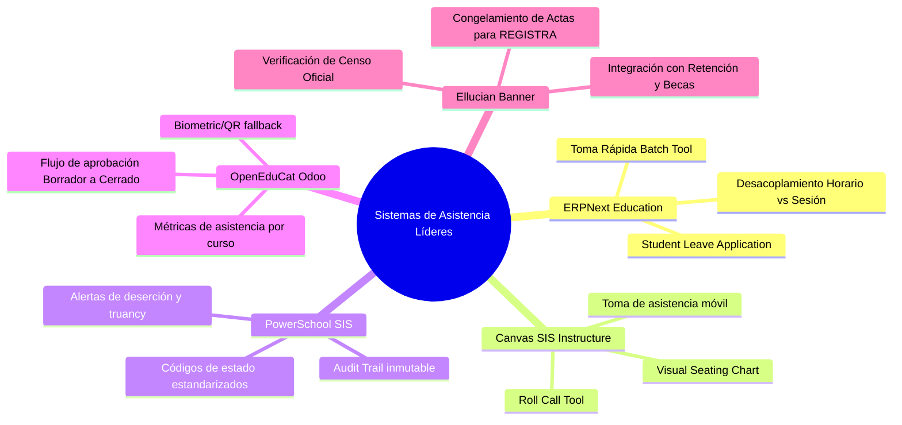
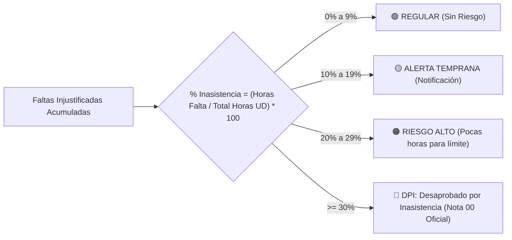
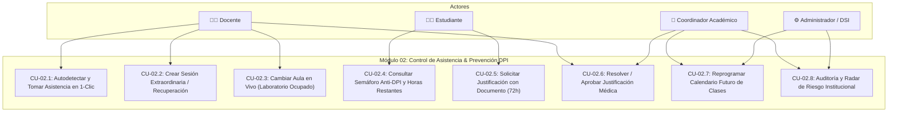
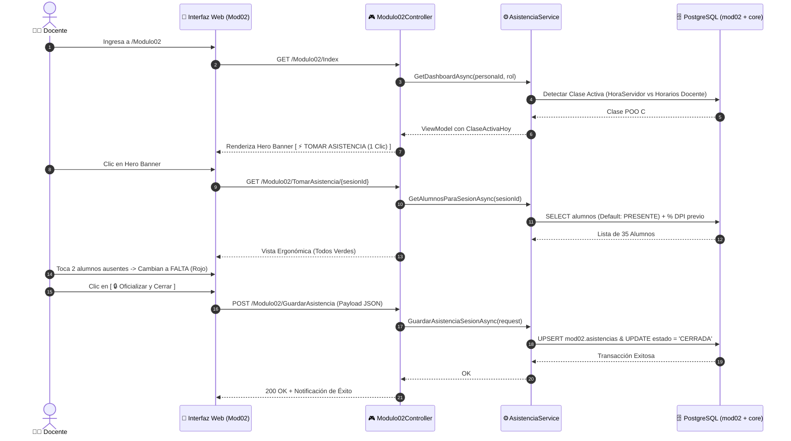
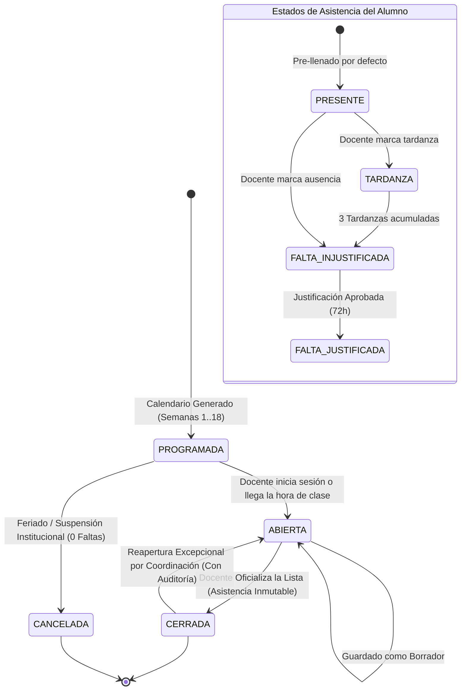
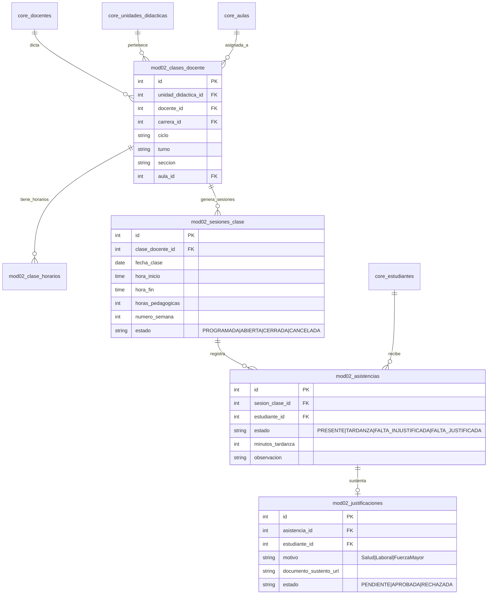

# 🏛️ Dossier Maestro de Ingeniería de Software: Módulo 02 (Asistencia & Prevención de Deserción DPI)
## Estudio Comparativo Global, Especificación Formal IEEE 830 y Diseño de Arquitectura de Misión Crítica

> **Proyecto:** Intranet Institucional Modular — IESTP "Argentina"  
> **Autor & Arquitecto de Sistemas:** Felipe  
> **Nivel de Ingeniería:** Senior Backend, Systems & Modular Software Architecture  
> **Stack de Implementación:** .NET 10 LTS (C# 13) + PostgreSQL 16 LTS (Esquemas Soberanos `mod02`) + TailwindCSS / DaisyUI  
> **Marco Normativo:** MPA 2024–2026 (R.D. N° 109), Ley N° 30512, RVM N° 277-2019 y RVM N° 177-2021-MINEDU  

---

## 🧭 Índice General del Dossier de Ingeniería

```
┌────────────────────────────────────────────────────────────────────────────────────────┐
│                        DOSSIER DE INGENIERÍA: MÓDULO 02 ASISTENCIA                     │
├──────────────────────────┬─────────────────────────────┬───────────────────────────────┤
│ 1. BENCHMARKING MUNDIAL  │ 2. INGENIERÍA DE REQUISITOS │ 3. MODELADO DE COMPORTAMIENTO │
│ • ERPNext Education      │ • Requisitos Funcionales    │ • Casos de Uso Formales (UML) │
│ • Canvas SIS Roll Call   │ • Requisitos No Funcionales │ • Diagramas de Flujo y Estado │
│ • PowerSchool Unified SIS│ • Reglas de Negocio MINEDU  │ • Diagramas de Secuencia E2E  │
├──────────────────────────┼─────────────────────────────┼───────────────────────────────┤
│ 4. ARQUITECTURA DE DATOS │ 5. GESTIÓN DEL CAOS REAL    │ 6. BLUEPRINT DE INTERFAZ (UX) │
│ • Bounded Context mod02  │ • Reprogramación de Horarios│ • Hero Card 1-Clic Docente    │
│ • Contrato Read-Only core│ • Sesiones Ad-hoc / Rescate │ • Semáforo Anti-DPI Alumno    │
│ • Vistas Materializadas  │ • Relevo Docente en Ciclo   │ • Matriz Excel 18 Semanas     │
└──────────────────────────┴─────────────────────────────┴───────────────────────────────┘
```

---

# 🌐 CAPÍTULO 1: Benchmarking Mundial de Sistemas Líderes

Para diseñar el mejor módulo de asistencia educativa, analizamos los 5 referentes globales de la industria educativa:



### 📊 Matriz Comparativa Internacional vs. Jaguar Soft vs. Nuestra Solución

| Característica / Patrón de Diseño | ERPNext Education | Canvas SIS | PowerSchool | Jaguar Soft (Legado) | Nuestra Arquitectura (.NET 10 + Mod02) |
| :--- | :---: | :---: | :---: | :---: | :---: |
| **Tiempo promedio de toma de lista (35 alumnos)** | ~25 seg | ~30 seg | ~40 seg | **> 3 minutos** (Lento) | **< 12 segundos** (Opt-In 1-Clic) |
| **Autodetección de Clase en Curso (1 Clic)** | 🟡 Parcial | 🟡 Parcial | 🔴 No (Menús) | 🔴 No (5 clics de búsqueda) | 🟢 **Sí (100% Contextual en tiempo real)** |
| **Pre-llenado de alumnos en PRESENTE** | 🟢 Sí | 🟢 Sí | 🟢 Sí | 🔴 No (Marcar uno a uno) | 🟢 **Sí (Gestión por Excepción)** |
| **Semáforo Predictivo de Deserción / DPI** | 🟡 Reporte | 🔴 No | 🟢 Sí (Truancy) | 🔴 No (Ceguera total) | 🟢 **Sí (Visual en vivo: Verde/Amarillo/Rojo/DPI)** |
| **Justificación digital en 72h con sustento** | 🟢 Sí (Leave) | 🔴 No | 🟡 Burocrático | 🔴 No (Cartas en papel) | 🟢 **Sí (Móvil con foto de certificado)** |
| **Resiliencia ante cambio de horarios a mitad de ciclo** | 🟢 Sí | 🟡 Regular | 🟡 Complejo | 🔴 Se corrompe la BD | 🟢 **Sí (Plantilla elástica + Pasado inmutable)** |
| **Soberanía y No Invasión a otros módulos** | 🟡 Monolito | 🟢 LTI API | 🔴 Propietario | 🔴 Código espagueti | 🟢 **Esquema Soberano PostgreSQL `mod02`** |

---

# 📋 CAPÍTULO 2: Especificación Formal de Requisitos (IEEE 830 / ISO 25010)

## 🎯 2.1 Requisitos Funcionales (RF)

* **RF-01 (Autodetección Contextual de Clase Activa):** El sistema debe identificar automáticamente la unidad didáctica, aula, sección y turno que el docente debe dictar en el momento exacto en que ingresa al módulo, calculando una ventana de tolerancia de $\pm 45$ minutos sobre el horario programado.
* **RF-02 (Toma de Asistencia Rápida por Excepción):** La interfaz de toma de asistencia debe cargar al 100% de los estudiantes matriculados en estado predeterminado `PRESENTE`. El docente solo interactuará con aquellos alumnos que presenten `FALTA_INJUSTIFICADA` o `TARDANZA`.
* **RF-03 (Oficialización y Cierre de Sesión):** El docente podrá guardar la asistencia en modo borrador o ejecutar la acción de "Oficializar y Cerrar", la cual estampa la fecha, hora y usuario auditor, congelando la edición directa para evitar adulteraciones posteriores.
* **RF-04 (Cálculo Automático de la Regla DPI 30%):** El sistema debe calcular en tiempo real el porcentaje de inasistencias sobre el total de horas semestrales de la Unidad Didáctica ($\text{Horas Falta} / \text{Horas Totales UD}$). Si el valor es $\ge 30\%$, el alumno adquiere de forma automática la condición `DPI`.
* **RF-05 (Suministro de Estado DPI al Módulo 03 de Calificaciones):** El Módulo 02 expondrá una vista de base de datos soberana (`mod02.v_resumen_asistencia_estudiante`) para que el Módulo 03 inhabilite el ingreso de notas y asiente `00` en actas sin requerir llamadas acopladas.
* **RF-06 (Bandeja y Flujo de Justificaciones con Límite de 72h):** El estudiante podrá registrar una solicitud de justificación adjuntando constancia médica o laboral dentro de los **3 días hábiles (72 horas)** posteriores a la sesión. Transcurrido dicho plazo, el sistema bloqueará la opción de justificación directa.
* **RF-07 (Resolución de Justificaciones por el Docente):** El docente titular o coordinador podrá evaluar la justificación (Aprobar/Rechazar). Al aprobarse, el registro de asistencia mutará automáticamente a `FALTA_JUSTIFICADA`, recalculando el porcentaje de DPI al instante.
* **RF-08 (Gestión de Sesiones Extraordinarias / Recuperaciones):** El docente podrá iniciar en 1 clic una sesión fuera del horario habitual (ej. recuperaciones de fin de semana), asociando la fecha/hora real al registro oficial.
* **RF-09 (Reprogramación Masiva de Horarios Futuros):** La Coordinación Académica podrá modificar el día, hora o aula de una clase para las semanas futuras sin que se altere ni una sola asistencia ya dictada y cerrada en las semanas previas.
* **RF-10 (Sábana Institucional de 18 Semanas):** Visualización matricial tipo Excel que consolida las 18 semanas del periodo académico (1 a 17 regulares y semana 18 de recuperación).

---

## ⚡ 2.2 Requisitos No Funcionales (RNF)

* **RNF-01 (Rendimiento y Latencia):** El tiempo de carga de la nómina de estudiantes y el guardado de la asistencia no debe exceder los **150 ms** utilizando Dapper y consultas optimizadas sobre PostgreSQL 16 con índices sobre `(sesion_clase_id, estudiante_id)`.
* **RNF-02 (Aislamiento y Soberanía de Esquema):** El módulo operará exclusivamente sobre el esquema `mod02.*`. No podrá realizar modificaciones (`INSERT`, `UPDATE`, `ALTER`) sobre el esquema `core` ni sobre otros esquemas modulares (`mod01` a `mod09`).
* **RNF-03 (Ergonomía Táctil y Mobile-First):** La interfaz de toma de asistencia debe tener objetivos táctiles mínimos de **48x48 píxeles** para permitir su uso fluido en teléfonos móviles y tablets sin zoom ni desplazamientos horizontales innecesarios.
* **RNF-04 (Trazabilidad e Inmutabilidad):** Toda modificación a una sesión cerrada registrará `usuario_modificador_id` y `fecha_modificacion` para fines de auditoría ministerial.

---

## ⚖️ 2.3 Reglas de Negocio Oficiales (MINEDU & IESTP Argentina)



1. **Regla RN-01 (Límite 30% DPI - MPA Art. 8.8.1):** Estudiante con $\ge 30\%$ de inasistencias injustificadas queda automáticamente desaprobado por inasistencias con nota `00`, sin derecho a examen de subsanación de Semana 18.
2. **Regla RN-02 (Tolerancia y Equivalencia):** Tolerancia máxima de tardanza: 15 minutos. 3 tardanzas equivalen al impacto pedagógico de 1 falta.
3. **Regla RN-03 (Ventana Legal de Justificación):** Máximo 72 horas hábiles desde el registro de la falta. Pasado el tiempo, el reclamo se eleva a Mesa de Partes mediante trámite FUT oficial (Módulo 06).
4. **Regla RN-04 (Estructura de 18 Semanas):** Semanas 1 a 17 corresponden a sesiones regulares de aprendizaje; la Semana 18 está reservada para Evaluación Extraordinaria y Subsanación.

---

# 📐 CAPÍTULO 3: Modelado de Comportamiento y Diagramas UML

## 3.1 Diagrama Formal de Casos de Uso



---

## 3.2 Diagrama de Secuencia: Flujo de Toma de Asistencia Rápida en 1 Clic



---

## 3.3 Diagrama de Estados: Ciclo de Vida de una Sesión y una Asistencia



---

# 🗄️ CAPÍTULO 4: Arquitectura de Datos y Dominio (PostgreSQL 16)



---

# 🎨 CAPÍTULO 5: Blueprint de Interfaz de Usuario (Zero-Friction UX)

### 1. Vista Docente: Hero Banner Contextual
```
┌─────────────────────────────────────────────────────────────────────────────────────────┐
│ ⚡ CLASE DETECTADA EN CURSO AHORA                                           ⏰ 18:35    │
│ 💻 Programación Orientada a Objetos en C# (DSI - Ciclo II Noche • Secc A)               │
│ 🏫 Aula: [ LAB-301 ▼ (Cambiar si está ocupado) ] • 34 Alumnos Matriculados             │
│                                                                                         │
│   ┌─────────────────────────────────────────────────────────────────────────────────┐   │
│   │   👉 [ ⚡ TOMAR ASISTENCIA AHORA - SEMANA 4 ]  (1 Solo Clic)                    │   │
│   └─────────────────────────────────────────────────────────────────────────────────┘   │
│   🔗 Opciones Rápidas: [ ➕ Iniciar Recuperación ] [ 📊 Ver Matriz 18 Semanas ]          │
└─────────────────────────────────────────────────────────────────────────────────────────┘
```

### 2. Vista Estudiante: Radar de Seguridad Anti-DPI
```
┌─────────────────────────────────────────────────────────────────────────────────────────┐
│ 🎓 MI PANEL DE ASISTENCIA Y CONTROL DE INASISTENCIAS (MINEDU)                           │
├─────────────────────────────────────────────────────────────────────────────────────────┤
│ 💻 POO en C# (DSI - II)                                                                 │
│ 🟢 ESTADO: REGULAR • 0 Horas de Falta (0.00%)                                           │
│ 🛡️ Margen: Tienes 21 horas disponibles de inasistencia antes de caer en DPI.             │
├─────────────────────────────────────────────────────────────────────────────────────────┤
│ 🗄️ Taller de Base de Datos II (DSI - II)                                                │
│ 🟠 ESTADO: RIESGO ALTO • 16 Horas de Falta (22.22%)                                      │
│ ⚠️ ¡ATENCIÓN! A solo 4 horas de inasistencia del límite máximo de DPI (30%).             │
│                                                                                         │
│ Historial Reciente:                                                                     │
│ • 25/09/2026 (Semana 3 - 4h): 🔴 FALTA INJUSTIFICADA ──► [ 📎 Justificar (Quedan 24h) ] │
└─────────────────────────────────────────────────────────────────────────────────────────┘
```

---

### 🏆 Conclusión del Estudio de Ingeniería
Este diseño técnico resuelve de raíz todos los defectos de usabilidad del software legado (*Jaguar Soft*), garantiza el cumplimiento estricto de las directivas del **MINEDU**, protege la integridad de los datos ante cambios de horario del instituto y brinda una velocidad operativa de estándar internacional.
