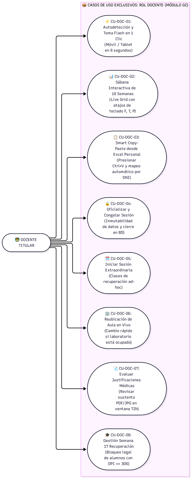
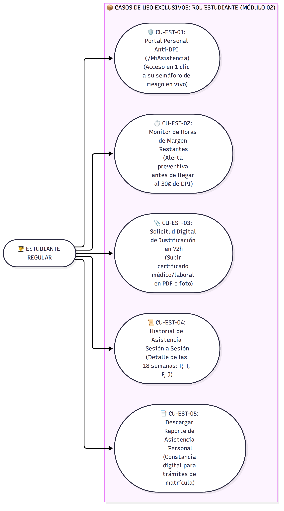
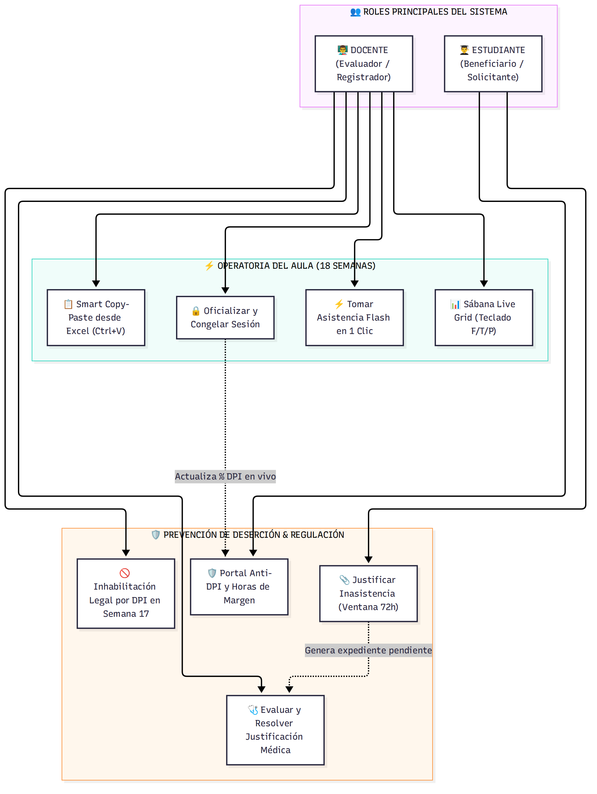
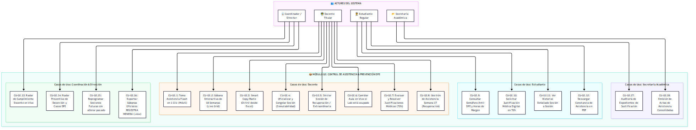
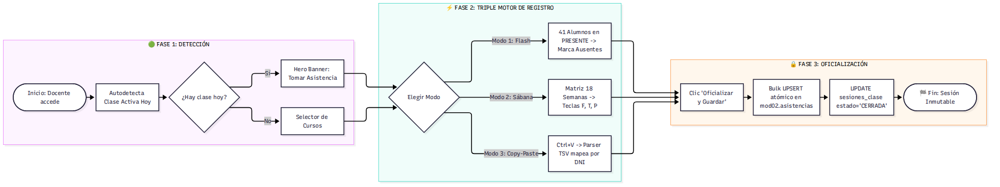
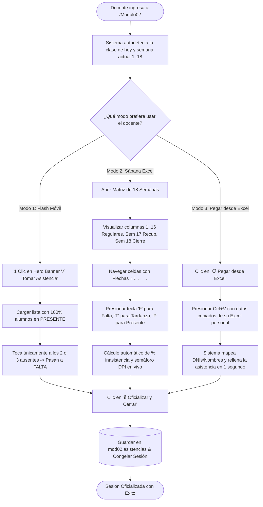
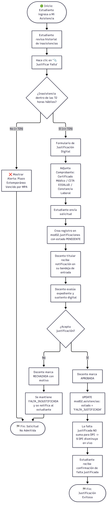
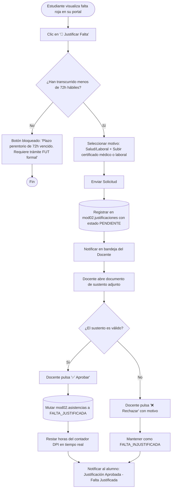
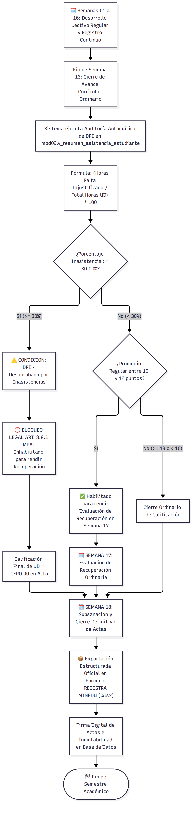
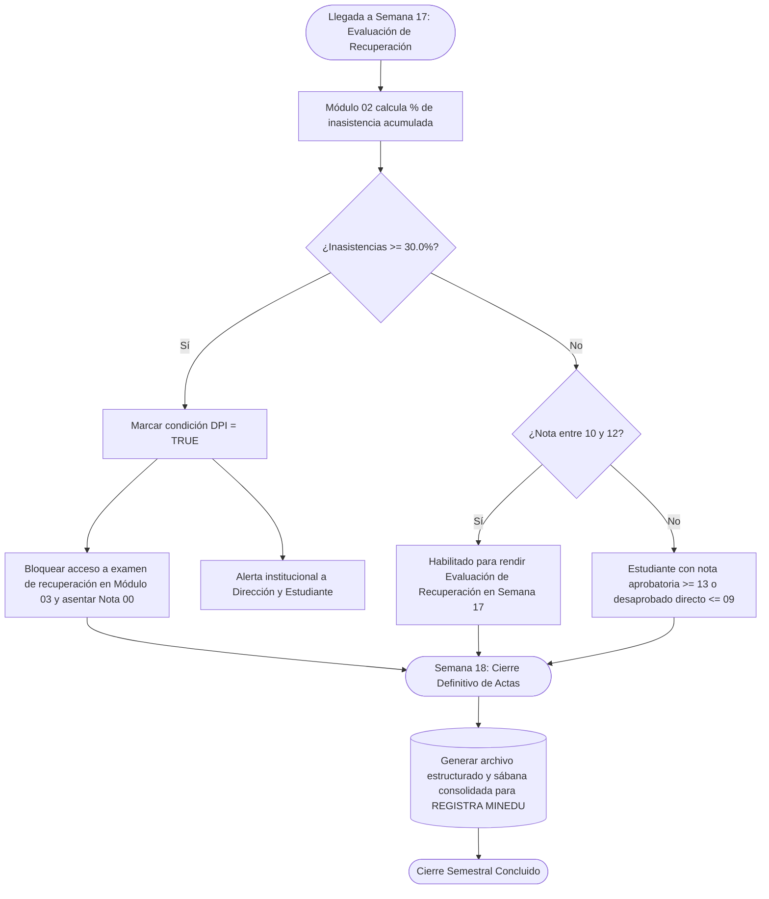

# 📦 Documento Maestro de Especificación de Producto (PRD)
## Módulo 02: Control de Asistencia Institucional, Rediseño "Excel-Killer" y Prevención de Deserción (DPI)

> **Para:** Product Manager (PM), Dirección Académica, Evaluadores de Licenciamiento & Docentes  
> **Autor / Product Owner Técnico:** Felipe (Equipo 02 - Asistencia)  
> **Proyecto:** Intranet Institucional Modular — IESTP "Argentina"  
> **Alcance:** 100% Soberano y Autónomo en Módulo 02 (Esquema `mod02`)  
> **Marco Normativo:** Ley N° 30512 • RVM N° 277-2019-MINEDU • RVM N° 177-2021-MINEDU • MPA (R.D. N° 109-V-DIR-2024) • RI (R.D. N° 005-V-DIR-2025)  
> **Versión:** 3.5 (Alineación Integral con el Ciclo de 18 Semanas, Semana 17 de Recuperación, Semana 18 de Cierre REGISTRA y Triple Experiencia Docente)  

---

## 🏛️ 1. Marco Normativo Oficial, Estructura de 18 Semanas y Reglas Institucionales

El diseño de este módulo responde rigurosamente a las **Condiciones Básicas de Calidad (CBC)** para el Licenciamiento Institucional y al **Manual de Procedimientos Académicos (MPA 2024–2026)** aprobado mediante **Resolución Directoral N° 109-V-DIR-2024-IESTP."ARGENTINA"**:

### 📅 Estructura Oficial del Semestre Académico (18 Semanas Lectivas)

```
┌────────────────────────────────────────────────────────────────────────────────────────────────────────┐
│                        ESTRUCTURA DEL SEMESTRE ACADÉMICO — IESTP "ARGENTINA" (18 SEMANAS)              │
├────────────────────────────────────────┬─────────────────────────────┬─────────────────────────────────┤
│        SEMANAS 01 A 16                 │         SEMANA 17           │           SEMANA 18             │
│    Desarrollo Lectivo Regular          │   Evaluación de Recuperación│   Subsanación y Cierre REGISTRA │
├────────────────────────────────────────┼─────────────────────────────┼─────────────────────────────────┤
│ • Avance continuo de capacidades.      │ • Proceso de recuperación   │ • Consolidación de asistencias. │
│ • Evaluaciones formativas continuas.   │   ordinaria para notas 10-12│ • Auditoría final de DPIs (00). │
│ • Registro sesión a sesión (P/T/F/J).  │ • ⚠️ Alumnos con DPI quedan │ • Generación de Actas Oficiales │
│ • Alertas tempranas preventivas DPI.   │   INHABILITADOS por Ley.    │   para importación en REGISTRA. │
└────────────────────────────────────────┴─────────────────────────────┴─────────────────────────────────┘
```

| Bloque Semanal | Denominación y Base Legal | Lógica y Comportamiento en Módulo 02 |
| :--- | :--- | :--- |
| **Semanas 01 a 16** | **Desarrollo Lectivo Regular**<br>*(RVM N° 277-2019 / LAG)* | Avance de sesiones ordinarias. Registro continuo en los modos Flash (Móvil), Sábana (Live Grid) y Smart Copy-Paste (`Ctrl+V`). Los alumnos con inasistencias reciben alertas en tiempo real. |
| **Semana 17** | **Evaluación de Recuperación Ordinaria**<br>*(Art. 8.8.1 MPA 2024)* | Semana exclusiva para rendir evaluaciones de recuperación de capacidades para estudiantes con promedio entre **10 y 12 puntos**.<br>🚫 **Bloqueo Inmediato:** Quien acumuló $\ge 30\%$ de inasistencias injustificadas (**DPI**) queda **inhabilitado por ley** para rendir recuperación. |
| **Semana 18** | **Subsanación / Cierre y Actas REGISTRA**<br>*(Art. 8.8.2 MPA / MINEDU)* | Consolidación y cierre inmutable del registro de asistencia. Auditoría final de inasistencias y exportación estructurada de sábanas oficiales para la plataforma **REGISTRA del MINEDU**. |

---

### ⚖️ Reglas de Negocio Críticas

1. **Regla de Desaprobación por Inasistencias (DPI - Art. 8.8.1 MPA):**
   $$\text{Porcentaje de Inasistencias} = \left( \frac{\sum \text{Horas de Falta Injustificada}}{\text{Total Horas Programadas de la UD}} \right) \times 100$$
   * Si $\text{Porcentaje} \ge \mathbf{30.00\%}$, el sistema marca automáticamente la condición **DPI**.
   * El estudiante con DPI obtiene nota **00 (cero)** en actas oficiales y **pierde todo derecho a rendir la evaluación de recuperación de la Semana 17**, debiendo volver a cursar la Unidad Didáctica obligatoriamente.
2. **Plazo Estricto de Justificación de Inasistencias:**
   * El estudiante dispone de un plazo perentorio de **72 horas hábiles (3 días hábiles)** posteriores a la fecha de la inasistencia (o al reincorporarse si hubo descanso médico) para solicitar su justificación digital adjuntando su certificado oficial (MINSA, EsSalud o constancia laboral).
   * Una justificación aprobada transmuta el registro a `FALTA_JUSTIFICADA`, restando horas al contador de DPI.
3. **Arquitectura Independiente de Horarios ("Schedule-Free"):**
   * El instituto opera con constantes cambios manuales de horarios y aulas. El Módulo 02 no depende de un módulo rígido externo de horarios; se rige por **Semanas de Sílabo (1 a 18)** e identificación contextual de carga académica por docente, permitiendo reprogramar sesiones futuras a partir de una Semana $N$ sin alterar el pasado histórico.

---

## 🧭 2. Diagnóstico de Campo & Propuesta de Valor ("Excel-Killer")

### 🔍 El Descubrimiento en las Entrevistas a Docentes
* **El competidor no es otro software, es el archivo Excel o la hoja de papel:** Los profesores prefieren su Excel personal porque acceden en **3 clics** desde su laptop/USB, tienen la **sábana visual de las 18 semanas** y marcan `F` a los ausentes en segundos.
* **El dolor a fin de ciclo:** Tienen que sumar a mano cientos de celdas, calcular porcentajes con calculadora para ver quién tiene DPI ($\ge 30\%$) y transcribir notas.
* **La solución de Módulo 02:** Adaptarse a su flujo natural con la **Triple Experiencia Docente**:

```
┌────────────────────────────────────────────────────────────────────────────────────────┐
│                        LA TRIPLE EXPERIENCIA DOCENTE EN MÓDULO 02                      │
├──────────────────────────┬─────────────────────────────┬───────────────────────────────┤
│ ⚡ 1. MODO FLASH (Móvil) │ 📊 2. SÁBANA LIVE GRID      │ 📋 3. SMART COPY-PASTE (Ctrl+V)│
│ • Autodetección de clase │ • Matriz 18 semanas en web. │ • Pega directo desde su Excel │
│   activa en 1 clic.      │ • Distintivo Sem 17 y 18.   │   personal con Ctrl+V.        │
│ • Lista en PRESENTE.     │ • Atajos de teclado:        │ • Carga 18 semanas o una      │
│ • Pase en 8 segundos.    │   Flechas, F, T, P.         │   semana en 1 segundo.        │
│ • Modo Offline PWA.      │ • Cierre y % DPI en vivo.   │ • Mapeo inteligente por DNI.  │
└──────────────────────────┴─────────────────────────────┴───────────────────────────────┘
```

---

## 👥 3. Matriz Exhaustiva de Casos de Uso por Rol

### 👨‍🏫 3.1. Casos de Uso del Rol Docente (CU-DOC-01 al CU-DOC-08)

El docente es el actor principal de registro. Cuenta con 3 motores para pasar asistencia según el contexto:


*Figura 3.1: Diagrama de Casos de Uso UML del Rol Docente (Toma Flash en Móvil, Sábana Live Grid de 18 Semanas, Smart Copy-Paste Ctrl+V y Justificaciones).*

---

### 👨‍🎓 3.2. Casos de Uso del Rol Estudiante (CU-EST-01 al CU-EST-05)

El estudiante es el beneficiario central del sistema de prevención de deserción. Tiene acceso en 1 clic a su Portal Anti-DPI:


*Figura 3.2: Diagrama de Casos de Uso UML del Rol Estudiante (Portal Anti-DPI, Monitor de Horas de Margen y Justificación Digital en 72 Horas).*

---

### 🔄 3.3. Interacción Dual Docente - Estudiante


*Figura 3.3: Diagrama de Interacción Operativa y Prevención de Deserción entre Docente y Estudiante.*

---

### 🏛️ 3.4. Matriz General Consolidada (Todos los Roles)


*Figura 3.4: Diagrama Consolidado de los 18 Casos de Uso del Módulo 02.*

---

## 📐 4. Diagramas de Actividades de Negocio

---

### 🔹 Diagrama de Actividades 1: Flujo Multimodal de Toma de Asistencia (Docente)


*Figura 4.1: Diagrama de Actividades del Flujo de Toma de Asistencia (Modo Flash, Sábana 18 Semanas y Smart Copy-Paste).*




---

### 🔹 Diagrama de Actividades 2: Flujo de Justificación Digital (Ventana Estricta 72h)


*Figura 4.2: Diagrama de Actividades para la Solicitud y Resolución de Justificaciones Médicas (Regla 72h).* 




---

### 🔹 Diagrama de Actividades 3: Auditoría y Cierre en Semana 17 y 18


*Figura 4.3: Diagrama de Actividades para la Detección Automática de DPI, Bloqueo de Semana 17 y Exportación REGISTRA MINEDU en Semana 18.*




---

## 📋 5. Historias de Usuario Formales (Formato Gherkin)

---

### 👤 HU-02.1: Toma de Asistencia Flash Contextual en 1 Clic
* **Como:** Docente de aula  
* **Quiero:** Que al entrar al módulo se autodetecte mi clase activa con la nómina en *PRESENTE*  
* **Para:** Pasar asistencia en menos de 10 segundos sin interrumpir el inicio de mi sesión de aprendizaje.  

```gherkin
Escenario: Detección exitosa y toma de asistencia en 10 segundos
  Dado que el docente inicia sesión en el horario de su clase (ej. Lunes 18:35)
  Cuando ingresa al Módulo 02
  Entonces observa el Hero Banner "⚡ TOMAR ASISTENCIA AHORA"
  Y al presionar el botón se abre la lista con los 35 alumnos en "PRESENTE"
  Y al tocar al alumno ausente cambia inmediatamente a "FALTA_INJUSTIFICADA" (Rojo)
  Y el contador superior actualiza en vivo: "Presentes: 34 | Faltas: 1".
```

---

### 👤 HU-02.2: Sábana Interactiva de 18 Semanas con Distinción de Semanas 17 y 18
* **Como:** Docente en su laptop  
* **Quiero:** Visualizar la matriz completa de 18 semanas destacando visualmente la Semana 17 (Recuperación) y Semana 18 (Cierre)  
* **Para:** Trabajar con la misma agilidad que en Excel pero con cálculo de DPI automatizado.  

```gherkin
Escenario: Edición fluida por teclado en la sábana
  Dado que el docente abre la vista "Matriz de 18 Semanas"
  Cuando se desplaza con la flecha "↓" hacia un estudiante y presiona la tecla "F"
  Entonces la celda se pinta de color rojo con la letra "F"
  Y la columna de resumen a la derecha actualiza en vivo el total de inasistencias y el semáforo DPI
  Y las columnas de Semana 17 y 18 muestran su encabezado distintivo de Recuperación y Cierre.
```

---

### 👤 HU-02.3: Smart Copy-Paste desde Excel Personal (`Ctrl+V`)
* **Como:** Docente que lleva su propio archivo Excel  
* **Quiero:** Copiar una columna o tabla de mi Excel y pegarla con `Ctrl+V` dentro del sistema  
* **Para:** Cargar las asistencias de todo el mes en 1 segundo sin digitar alumno por alumno.  

```gherkin
Escenario: Pegado masivo desde el portapapeles
  Dado que el docente copió una lista de asistencias desde su archivo Excel
  Cuando hace clic en "📋 Pegar desde Excel" y presiona "Ctrl+V"
  Entonces el sistema valida los DNIs y nombres de los estudiantes
  Y rellena automáticamente las celdas de asistencia correspondientes
  Y muestra el mensaje: "35 registros sincronizados desde Excel con éxito".
```

---

### 👤 HU-02.4: Oficialización y Congelamiento de Sesión (Inmutabilidad)
* **Como:** Docente de aula  
* **Quiero:** Cerrar y oficializar la sesión con un botón de confirmación  
* **Para:** Congelar el registro, estampar la firma de auditoría y evitar reclamos posteriores.  

---

### 👤 HU-02.5: Radar Semafórico Anti-DPI para Estudiantes
* **Como:** Estudiante del IESTP Argentina  
* **Quiero:** Ver mis horas de inasistencia acumuladas y el número exacto de horas antes de alcanzar el 30% de DPI  
* **Para:** Monitorear mi asistencia en tiempo real y evitar perder la asignatura por inasistencias.  

```gherkin
Escenario: Visualización de riesgo alto
  Dado que un estudiante acumula 16 horas de falta en un curso de 68 horas (23.5%)
  Cuando consulta su panel de "Mi Asistencia"
  Entonces observa el indicador "🟠 RIESGO ALTO (23.5%)"
  Y la alerta: "⚠️ A solo 4 horas de inasistencia de quedar inhabilitado por DPI (30%)".
```

---

### 👤 HU-02.6: Justificación Digital Móvil en 72 Horas
* **Como:** Estudiante que tuvo descanso médico o laboral  
* **Quiero:** Subir una foto de mi certificado desde mi celular dentro de los 3 días hábiles posteriores a la falta  
* **Para:** Solicitar la justificación de mi inasistencia de forma digital y sin cartas físicas.  

---

### 👤 HU-02.7: Inhabilitación Automática de DPI para la Semana 17 de Recuperación
* **Como:** Sistema Módulo 02 / Coordinación  
* **Quiero:** Que al llegar a la Semana 17 el sistema identifique a todos los alumnos con $\ge 30\%$ de inasistencias  
* **Para:** Bloquearlos del examen de recuperación ordinaria y reportar la condición DPI a actas oficiales con nota 00.  

```gherkin
Escenario: Bloqueo de recuperación a alumno con DPI
  Dado que un estudiante alcanzó el 32% de inasistencias en la Semana 16
  Cuando el docente abre el acta de recuperación de la Semana 17
  Entonces el sistema marca al estudiante con el badge rojo "DPI - INHABILITADO"
  Y bloquea el ingreso de nota de recuperación, asignando la nota final "00".
```

---

### 👤 HU-02.8: Sesión Extraordinaria y Recuperación Autónoma
* **Como:** Docente de aula  
* **Quiero:** Iniciar una sesión fuera de horario (ej. sábado por la mañana) en 1 clic  
* **Para:** Recuperar clases atrasadas e imputar las horas oficiales de inmediato.  

---

### 👤 HU-02.9: Reprogramación Elástica de Horarios Futuros (Coordinación)
* **Como:** Coordinador Académico  
* **Quiero:** Cambiar el día o aula de una clase a partir de la Semana N  
* **Para:** Adaptar el calendario institucional sin alterar las asistencias ya dictadas en el pasado.  

---

### 👤 HU-02.10: Exportación de Sábana y Acta Oficial para REGISTRA MINEDU
* **Como:** Coordinador / Secretaría Académica  
* **Quiero:** Descargar la sábana completa en `.xlsx` y el consolidado oficial estructurado para REGISTRA al término de la Semana 18  
* **Para:** Cerrar el periodo lectivo formalmente cumpliendo con todos los estándares del MINEDU.  

---

## 🎯 6. Matriz MoSCoW de Priorización

| Prioridad | Historias de Usuario Incluidas | Justificación de Negocio |
| :--- | :--- | :--- |
| **Must Have (Obligatorio)** | `HU-02.1` (Flash 1-Clic), `HU-02.2` (Sábana 18 Semanas), `HU-02.3` (Copy-Paste), `HU-02.4` (Cierre), `HU-02.5` (Semáforo DPI), `HU-02.6` (Justif. 72h), `HU-02.7` (Bloqueo DPI Sem 17) | Garantiza la adopción total docente superando al Excel y asegura el cumplimiento legal estricto del MINEDU. |
| **Should Have (Muy Importante)** | `HU-02.8` (Sesión Extraordinaria), `HU-02.9` (Reprogramación Futura), `HU-02.10` (Actas REGISTRA) | Resiliencia operativa ante la ausencia de un módulo de horarios y reportería oficial para cierre de ciclo. |
| **Could Have (Deseable)** | Descarga de plantilla personalizada `.xlsx` para docentes, selector rápido de aula en vivo. | Mayor comodidad operativa para docentes de laboratorios de cómputo. |
| **Won't Have (Descartado)** | Reconocimiento facial o geocercas GPS invasivas. | Descartado por complejidad innecesaria y costo de hardware. |

---

## 📊 7. Métricas de Éxito y KPIs del Producto

1. **Velocidad de Registro:** Reducción de **180 segundos a $< 10$ segundos** en aula.
2. **Cero Sorpresas de DPI:** **100% de estudiantes informados** en tiempo real de su margen de faltas antes de la Semana 17.
3. **Tiempo de Justificación:** De **15 días en papel** a **$< 48$ horas digitales**.
4. **Cero Doble Trabajo a Fin de Ciclo:** **0 horas dedicadas a contar celdas manuales** para emitir actas oficiales en la Semana 18.
