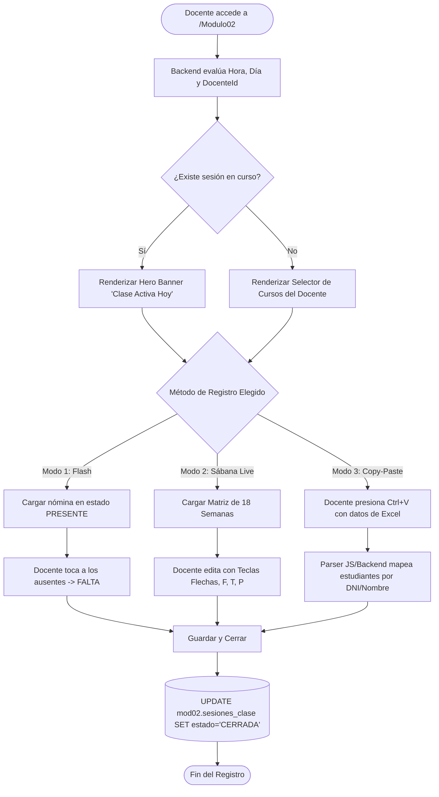
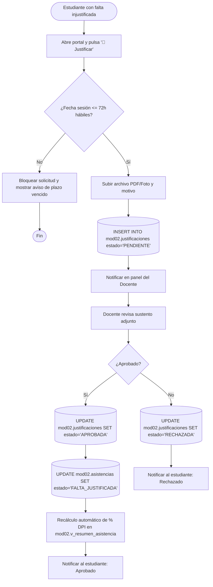
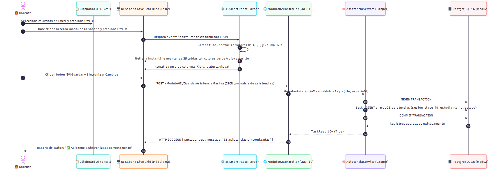
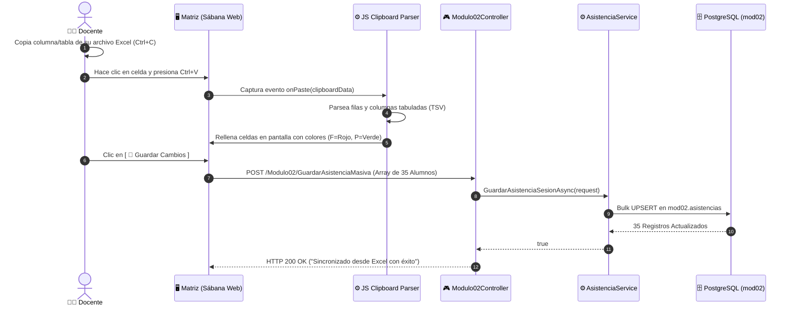
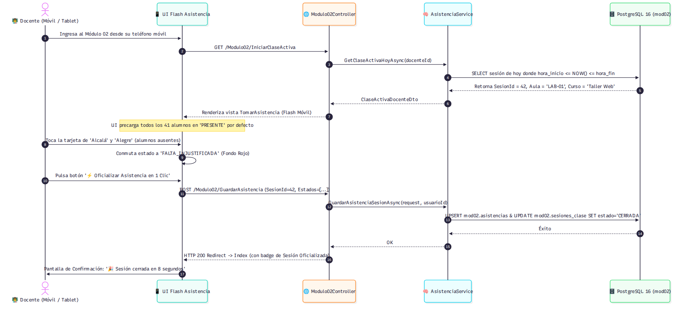
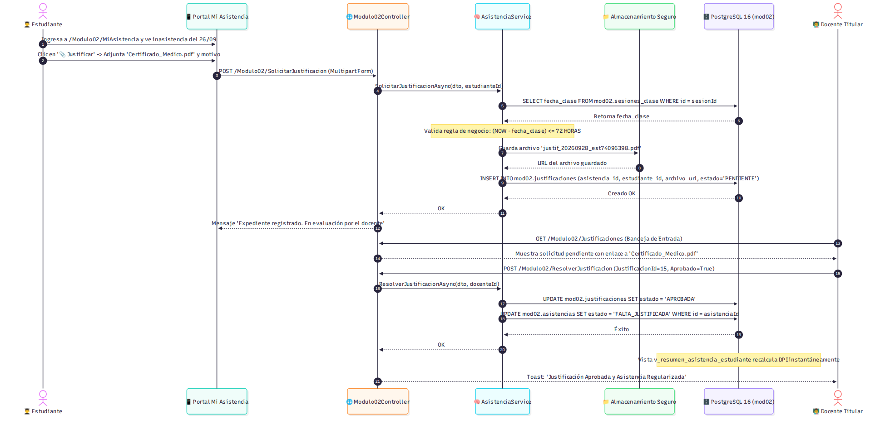
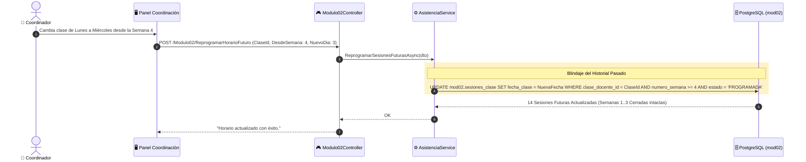
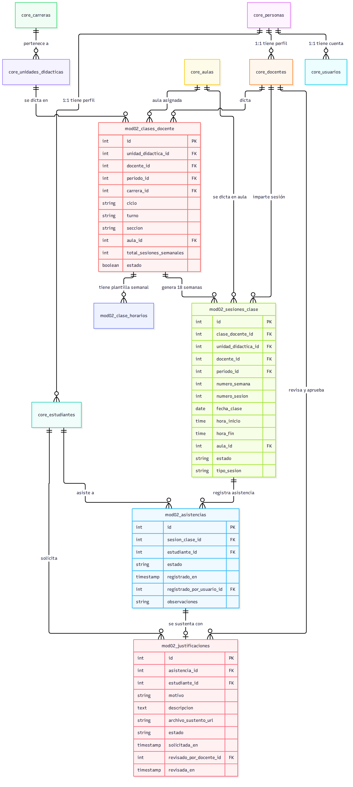

# 🛠️ Guía Técnica de Arquitectura, Diagramas & Especificación de Datos
## Módulo 02: Control de Asistencia Institucional & Prevención de Deserción DPI

> **Para:** Equipo de Desarrollo y Arquitecto de Software  
> **Autor:** Felipe (Equipo 02 - Asistencia)  
> **Stack:** .NET 10 LTS (C# 13) • PostgreSQL 16 LTS • Dapper • TailwindCSS / DaisyUI  
> **Arquitectura:** Esquema Soberano `mod02` con consumo en Solo Lectura de `core`  
> **Marco Normativo:** Ley N° 30512 • RVM N° 277-2019-MINEDU • RVM N° 177-2021-MINEDU • MPA (R.D. N° 109-V-DIR-2024) • RI (R.D. N° 005-V-DIR-2025)  
> **Versión:** 3.5 (Arquitectura del Rediseño Integral: Ciclo de 18 Semanas, Semana 17 Recuperación, Semana 18 Cierre y Esquema Schedule-Free)  

---

## 🧭 1. Principio de Aislamiento, Soberanía de Datos y Estructura de 18 Semanas

El Módulo 02 opera bajo **soberanía de esquema estricta (`mod02`)** y desacoplamiento de horarios externos:

```
┌────────────────────────────────────────────────────────────────────────────────────────┐
│                              FRONTERA DE DATOS DEL MÓDULO 02                           │
├─────────────────────────────────────────┬──────────────────────────────────────────────┤
│ 📖 ESQUEMA CENTRAL `core` (Solo Lectura)│ ✍️ ESQUEMA SOBERANO `mod02` (Control Total)   │
│ • core.estudiantes (Nómina oficial)     │ • mod02.configuracion (Parámetros y límites) │
│ • core.docentes (Planta docente)        │ • mod02.clases_docente (Carga y sílabo)      │
│ • core.unidades_didacticas (Asignaturas)│ • mod02.clase_horarios (Plantillas horario)  │
│ • core.aulas (Ambientes físicos)        │ • mod02.sesiones_clase (Semanas 1..18)       │
│ • core.periodos_academicos              │ • mod02.asistencias (Registros P/T/F/J)      │
│                                         │ • mod02.justificaciones (Expedientes 72h)    │
│                                         │ • mod02.v_resumen_asistencia_estudiante      │
└─────────────────────────────────────────┴──────────────────────────────────────────────┘
```

### 📅 Estructura Oficial de las 18 Semanas en la Base de Datos

En `mod02.sesiones_clase`, el campo `numero_semana` recorre de 1 a 18 con propósitos claros:
* **Semanas 01 a 16:** Sesiones lectivas regulares ordinarias (`tipo_sesion = 'REGULAR'`).
* **Semana 17:** Sesión de Evaluación de Recuperación Ordinaria (`tipo_sesion = 'RECUPERACION_SEMANA_17'`).
* **Semana 18:** Cierre final de asistencias y exportación para REGISTRA (`tipo_sesion = 'CIERRE_ACTAS_SEMANA_18'`).

---

## 📐 2. Diagramas de Casos de Uso por Rol (UML)

### 👨‍🏫 2.1. Casos de Uso: Rol Docente (Operador de Asistencia)

*Figura 2.1: Diagrama UML de Casos de Uso del Docente en el Módulo 02.*

---

### 👨‍🎓 2.2. Casos de Uso: Rol Estudiante (Portal Anti-DPI)

*Figura 2.2: Diagrama UML de Casos de Uso del Estudiante (Anti-DPI y Justificaciones 72h).*

---

### 🏛️ 2.3. Diagrama General Consolidado (Docente, Estudiante, Coordinación y Secretaría)

*Figura 2.3: Arquitectura Consolidada de Casos de Uso del Módulo 02.*

---

## 🔄 3. Diagramas de Actividades del Sistema

---

### 🔹 Diagrama de Actividades: Flujo de Toma de Asistencia Multimodal


*Figura 3.1: Diagrama de Actividades del Flujo de Registro de Asistencia Multimodal.*




---

### 🔹 Diagrama de Actividades: Flujo de Justificación y Recálculo de DPI


*Figura 3.2: Flujo de Solicitud de Justificación, Ventana 72h y Recálculo Dinámico de DPI.*




---

## ⚡ 4. Diagramas de Secuencia E2E Críticos

---

### 🔹 Secuencia 1: Smart Copy-Paste desde Excel (`Ctrl+V`)


*Figura 4.1: Diagrama de Secuencia E2E del Smart Copy-Paste desde Excel con Dapper Bulk UPSERT.*




---


---

### 🔹 Secuencia 2: Toma de Asistencia Flash Móvil (1 Clic)


*Figura 4.2: Diagrama de Secuencia E2E para la Autodetección de Clase Activa y Cierre en 1 Clic.*

---

### 🔹 Secuencia 3: Flujo Completo de Justificación Digital (Ventana 72h)


*Figura 4.3: Diagrama de Secuencia E2E para la Carga de Sustento, Evaluación Docente y Reclasificación en Vivo.*

### 🔹 Secuencia 4: Reprogramación Elástica de Horarios Futuros



---

## 🏛️ 5. Modelo Entidad-Relación Soberano (`mod02`)


*Figura 5.1: Diagrama Entidad-Relación (ERD) del Esquema Soberano mod02 y sus referencias a core.*

---

## 🗄️ 6. Diccionario de Datos del Esquema `mod02`

| Tabla / Vista | Propósito de Negocio | Claves Foráneas |
| :--- | :--- | :--- |
| `mod02.configuracion` | Parámetros del módulo (30% DPI, 15m tolerancia, 72h justificaciones). | N/A |
| `mod02.clases_docente` | Asignación de unidad didáctica, docente, ciclo, turno y aula. | $\rightarrow$ `core.unidades_didacticas`, `core.docentes`, `core.aulas` |
| `mod02.clase_horarios` | Plantilla semanal (Día 1..6, hora inicio/fin, horas pedagógicas). | $\rightarrow$ `mod02.clases_docente` |
| `mod02.sesiones_clase` | Instancias de clase de las 18 semanas (`REGULAR`, `RECUPERACION_SEMANA_17`, `CIERRE_ACTAS_SEMANA_18`). | $\rightarrow$ `mod02.clases_docente`, `core.docentes`, `core.aulas` |
| `mod02.asistencias` | Estado por estudiante (`PRESENTE`, `TARDANZA`, `FALTA_INJUSTIFICADA`, `FALTA_JUSTIFICADA`). | $\rightarrow$ `mod02.sesiones_clase`, `core.estudiantes` |
| `mod02.justificaciones` | Expedientes de descanso médico/laboral dentro de las 72h hábiles. | $\rightarrow$ `mod02.asistencias`, `core.estudiantes` |
| `mod02.v_resumen_asistencia_estudiante` | Vista de cálculo: horas acumuladas, porcentaje de faltas y condición DPI ($\ge 30\%$). | JOIN `mod02.asistencias` + `core.estudiantes` |

---

## 💻 6. Contrato de Servicio C# (`IAsistenciaService.cs`)

```csharp
namespace Intranet.Modulo02.Services;

public interface IAsistenciaService
{
    // 1. Detección Inteligente y Dashboard
    Task<DashboardAsistenciaViewModel> GetDashboardAsync(int? personaId, string rol);
    Task<ClaseActivaDocenteDto?> GetClaseActivaHoyAsync(int docenteId);

    // 2. Toma de Asistencia (Flash, Sábana y Smart Copy-Paste)
    Task<IEnumerable<AlumnoAsistenciaItemDto>> GetAlumnosParaSesionAsync(int sesionId, int unidadDidacticaId);
    Task<bool> GuardarAsistenciaSesionAsync(GuardarAsistenciaRequestDto request, int? usuarioId);
    Task<bool> GuardarAsistenciaMasivaMatrizAsync(GuardarMatrizRequestDto request, int? usuarioId);
    Task<SesionClaseDto> IniciarSesionExtraordinariaAsync(int claseId, string motivo);
    Task<bool> CambiarAulaEnVivoAsync(int sesionId, int nuevaAulaId);

    // 3. Portal del Estudiante & Semáforo Anti-DPI
    Task<IEnumerable<ResumenAsistenciaEstudianteDto>> GetResumenEstudianteAsync(int estudianteId, int? periodoId = null);
    Task<IEnumerable<AsistenciaHistorialItemDto>> GetHistorialDetalladoEstudianteAsync(int estudianteId, int unidadDidacticaId);

    // 4. Justificaciones (Ventana 72h)
    Task<IEnumerable<JustificacionDto>> GetJustificacionesAsync(int? estudianteId = null, string? estado = null);
    Task<bool> SolicitarJustificacionAsync(CrearJustificacionDto dto, int estudianteId);
    Task<bool> ResolverJustificacionAsync(ResolverJustificacionDto dto, int docenteId);

    // 5. Cierre Semanal, Auditoría REGISTRA y Gestión de Horarios
    Task<bool> ReprogramarSesionesFuturasAsync(ReprogramarHorarioDto dto);
    Task<IEnumerable<AlertaDpiDto>> GetAlertasDpiAsync(int? carreraId = null, int? periodoId = null);
    Task<byte[]> ExportarSabanaOficialExcelAsync(int claseDocenteId);
    Task<byte[]> GenerarActaRegistraMineduAsync(int claseDocenteId);
}
```
